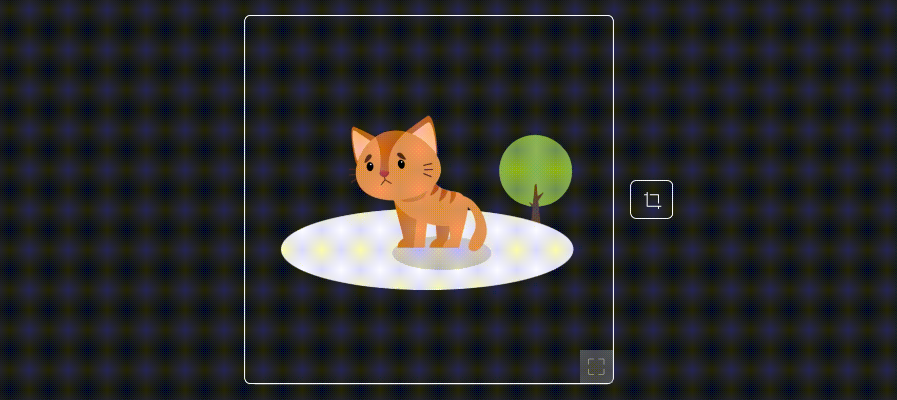

# SimpleLottiePlayer - A simple LottieFile web player (and LottieFile padding remover)

I do like a lot [_LottieFiles_](https://lottiefiles.com) animations. And I find that they are very nice to add some interactivity to web and mobile applications.

But I do not like the web player offered in the [_LottieFiles_ Github Repo](https://github.com/_LottieFiles_/lottie-player). I find that it is a bit awful and has too much overhead. Moreover, I wanted to create a _LottieFiles_ trimmer (i.e. removing the part of the animation outside the minimal bounding box), and I needed to use the legacy [LottieWeb](https://github.com/airbnb/lottie-web) library.

At the end, I decided to create my LottiePlayer which is much simpler than the one from _LottieFiles_, but it also includes some features that may help developers to make their applications simpler.

Additionally, I created a _in-memory_ LottiePlayer (which enables the same features, without the need of showing the results to the end-user), and a _LottieFiles_ trimmer, which is capable of removing the blank margins of a Lottie animation (without modifying the original content).

Please check the working demos:
- Simple Lottie Player demo: [link](https://dealfonso.github.io/simplelottieplayer/)
- LottieFiles trimmer: [link](https://dealfonso.github.io/simplelottieplayer/lottietrimmer.html)
- Very Simple Lottie Player demo: [link](https://dealfonso.github.io/simplelottieplayer/verysimplelottieplayer.html)



This package also includes a class that adjusts any Lottie animation to remove the padding and margins, so that the rendered animation only contains the minimal windows to show the animated objects.

## Simple Lottie Player


### Using _Simple Lottie Player_

To use _Simple Lottie Player_ you need to include it in your project (I recommend using the CDN), along with the dependency [lottie_svg](https://github.com/airbnb/lottie-web):

```html
<script src="https://cdnjs.cloudflare.com/ajax/libs/lottie-web/5.10.2/lottie_svg.js"></script>
<script src="https://cdn.jsdelivr.net/gh/dealfonso/simplelottieplayer@1/simplelottieplayer.min.js"></script>
```

And then just add a tag like the next one:

```html
<simplelottie id="myplayer" overlay-buttons fullsize-button autoplay loop max-height="300" url="https://assets6.lottiefiles.com/packages/lf20_fj8rlma5.json"></simplelottie>
```

It is possible to customize many parameters of the _Simple Lottie Player_, but you can also keep control of the CSS appearance of the container and the player. The `simplelottie` tag with the full parameters is the next:

```html
<simplelottie
    url="https://assets6.lottiefiles.com/packages/lf20_fj8rlma5.json"
    max-width="300"
    max-height="300"
    autosize="false"
    loop="true"
    repeat-count="0"
    autoplay="true"
    control-buttons="true"
    css-class-control-buttons="control-buttons"
    fullsize-button="true"
    css-class-fullsize-button="fullsize-button"></simplelottie>
```

The parameters are:
- `url`: the URL from which to retrieve the animation.
- `max-width` and `max-height`: when resizing the animation using `resize(...)` function, these values limit the size of the containers, while keeping the aspect ratio for the animation.
- `autosize`: if set to true the container is resized to the size of the animation (observing `max-witdh` and `max-height`), when an animation is loaded.
- `loop`: if set to true, the animation will play in loop when loaded, for a number of times (see `repeat-count`).
- `repeat-count`: if set to a number, the animation will play that number of times and then stop (0 means _forever_). This parameter is ignored if `loop` is set to false.
- `autoplay`: if set to true, the animation will start playing when loaded.
- `control-buttons`: if set to true, the animation will _pause_ or _play_ when clicking on it (and an overlay icon will appear).
- `css-class-control-buttons`: are a space-separated list of classes to add to the control buttons.
- `fullsize-button`: if set to true, a button will be overlayed on the animation to enable resizing the container to its full size (ignoring max-width and/or max-height), and get back to the limited size.
- `css-class-fullsize-button`: are a space-separated list of classes to add to the fullsize button.

### Using Javascript

Instead of using the declarative way using the `simplelottie` tag, it is possible to use `SimpleLottiePlayer` programmatically in javascript.

This also enables to add handlers on events and better customize the player. To make it, you can use the next command:

```javascript
let lottiePlayer = new SimpleLottiePlayer(player, options);
```

Where
- `player`: can be either a selector string to use in the document (e.g. '#lottie-player'), or an HTML Element (e.g. `document.getElementById('lottie-player')`).
- `options`: is a dictionary that enables to customize the options for the lottie player. 

The default values for the options (along with their explanation) are the next:

```javascript
let defaultOptions = {
    // The URL to load the animation
    url: null,
    // Function called when the animation has just been loaded
    onAnimationLoaded: (animationData, player) => {},
    // Max width when resizing
    maxWidth: null,
    // Max height when resizing
    maxHeight: null,
    // Start playing on load
    autoplay: true,
    // Loop the animation forever
    loop: true,
    /// Number of times the animation should be repeated (0 means infinite, 1 means play once, 2 means play twice, etc.)
    //  (*) if loop is set to false, this parameter is ignored
    repeatCount: 0,
    // Automatically resize the container to the size of the animation, on animation loaded
    autosize: false,
    // Add two overlay divs that act as buttons (play and pause, that work depending on the animation is playing or not)
    controlButtons: false,
    // Add an overlay button that makes the player to display at full size (ignoring the maxWidth and maxHeight parameters)
    fullsizeButton: false,
    // CSS class for buttons
    cssClassControlButtons: null,
    // CSS class for buttons
    cssClassFullsizeButton: null,
    // Function called whenever the play button is clicked
    onPlayBtn: (player) => {},
    // Function called whenever the pause button is clicked
    onPauseBtn: (player) => {},
    // Function called whenever the animation is played
    onPlay: (player) => {},
    // Function called whenever the animation is stopped
    onStop: (player) => {},
    // Function called whenever the animation is paused
    onPause: (player) => {}
}
```

The object has a list of methods:

- `play(from = null)`: Plays the animation (from a specific frame, if needed)
- `stop()`: Stops the animation and puts it at the beginning so that if it is played again, it will start from frame 0.
- `pause()`: Pauses the animation so that if it is started to play again, it will continue from the frame on it has been paused
- `isPaused()`: Obtains the value of whether the animation has been paused or not
- `currentFrame()`: Obtains the frame number that is being rendered.
- `async load(pathToAnimation, options = null)`: Loads a lottie animation from the parameter _pathToAnimation_, that can be either a JSON object, a string with a JSON content, or an URL from which to obtain the JSON content. It also sets the new options for the object (if provided).
- `async updateOptions(options)`: Sets new options for the animation (this call triggers _onAnimationLoaded_).
- `getFrame(frame)`: Obtains a SVG from a frame number _frame_.
- `resize(newWidth, newHeight, force = false)`: Updates the size of the container of the player. It takes into account the values maxWidth and maxHeight in the options. If set, they are respected as maximum sizes but the aspect ratio will be kept. If _force_ is set to true, the maxWidth and maxHeight are ignored.

Once an object has been associated to a _SimpleLottiePlayer_ object, it is possible to retrieve the _SimpleLottiePlayer_ from the HTML element:

```javascript
let element = document.getElementById('my-lottie-player');
let simpleLottiePlayer = element.getLottiePlayer();
```

Then you can update the options if needed:

```javascript
simpleLottiePlayer.updateOptions({
    onAnimationLoaded: () => console.log("animation loaded"),
    onPlayBtn: () => console.log("play button pressed"),
    onPauseBtn: () => console.log("pause button pressed")
})
```

### MemLottiePlayer

This class works exactly as _SimpleLottiePlayer_ except that it is not backed by a container in the DOM. So it enables rendering frames from Lottie animations without showing them.

The constructor, functions, and so on work exactly as in SimpleLottiePlayer.

## LottieFiles animation trimmer
One problem with the Lottie animations is that they are a bit difficult to edit. It is true that it exists the [online editor](https://editor.lottiefiles.com/), that enables to change some settings (e.g. colors, layers, etc.).

But I found a problem with some of the animations, that is that many of them leave a lot of empty space around the objects that are animated. That means that I needed to calculate the sizes, taking into account the empty spaces, and I could not place things near the objects if there were margins.

What I wanted was to somehow __trim__ the Lottie animations (i.e. removing the margins), and this could be done using [Adobe AfterEffects](https://www.adobe.com/es/products/aftereffects.html). But I do not want to pay a full license just to _trim_ a few Lottie animations. And this is why I created a mechanism to _trim_ LottieFiles animations.

Checkout the demo of the [LottieFiles Trimming application](https://dealfonso.github.io/simplelottieplayer/lottietrimmer.html)

### Using the trimmer
First you need to include the trimmer (which is included in the _SimpleLottiePlayer_ bundle)

```html
<script src="https://cdnjs.cloudflare.com/ajax/libs/lottie-web/5.10.2/lottie_svg.js"></script>
<script src="https://cdn.jsdelivr.net/gh/dealfonso/simplelottieplayer@1/simplelottieplayer.min.js"></script>
```

And now you can use the _LottieUtils_ namespace to calculate the bounding box and to trim the animation.

```javascript
let boundingBoxes = await LottieUtils.calculateBoundingBox(lottiePlayerRender, animation["ip"], animation["op"], onFrame);
let boundingBox = boundingBoxes["animationBoundingBox"];
let resultingAnimation = LottieUtils.trimAnimation(animation, boundingBox[0], boundingBox[1], boundingBox[2], boundingBox[3]);
```

As a result you'll have your animation ready to be used in your player:

```javascript
lottiePlayerResult.load(resultingAnimation);
```

### LottieUtils

- `trimAnimation(animation, minX, minY, maxX, maxY)`: Makes that the lottie _animation_ (as a javascript object) is rendered to make that the window shown is (minX, minY)-(maxX, maxY). The function does not modify the animation.
- `calculateBoundingBox(player, firstFrame = null, lastFrame = null, onFrameCallback = (currentFrame, frameBoundingBox, animationBoundingBox, minFrame, maxFrame) => true)`:
    calculates the bounding box for the animation loaded in the SimpleLottiePlayer _player_, from frame _firstFrame_ to frame _lastFrame_. If provided, the function _onFrameCallback_ will be called each time a frame is analized.

### What the trimmer does
The animation's frames are rendered, and the bounding box is calculated for each of them.

Once the bounding box is calculated for the whole animation, the lottie animation is updated by using a [precomposition layer](https://lottiefiles.github.io/lottie-docs/layers/#precomposition-layer) which is adjusted to make that the part shown in the animation is the window that corresponds to the bounding box. Using this method, the shapes are not modified at all and the
animation can still be edited in other software such as _Adobe AfterEffects_.
